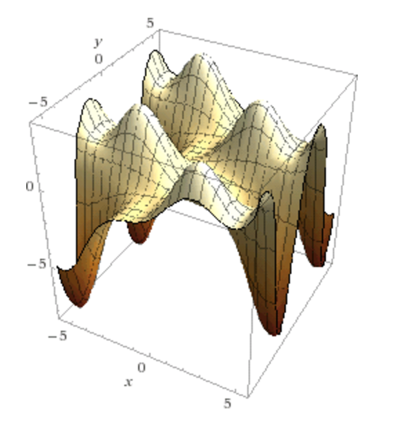

# CSC180Assign4 - David Judilla & Kyle Szombathy
# Part 2

## Original Function
```
x/2*sin(x) +  y/2*sin(y)
```


```c++
(def in-list1 '(-13 -12 -11 -10 -9 -8 -7 -6 -5 -4 -3 -2 -1 0 1 2 3 4 5 6 7 8 9 10 11 12))
(def in-list2 '(-26 -24 -22 -20 -18 -16 -14 -12 -10 -8 -6 -4 -2 0 2 4 6 8 10 12 14 16 18 20 22 24 ))
(def out-list '(12.854429114 -14.0863778521 -6.0973056415 6.40934695283 -4.69829279474 1.65420645317 9.56219788474 
-4.0576840026 -5.59687837844 2.44382799588 -0.556006478477 -0.60430756379 1.75076841163 0.0 0.909297426826 -0.60430756379 
-0.697126486537 2.44382799588 -4.63795410377 -4.0576840026 8.90521128602 1.65420645317 -5.11041127998 6.40934695283 -5.09731543495 -14.0863778521 ))

```

# Best outputs 
## Output 1
```c++ 
n1 = 15 
n2 = 20
  (let [options {:iterations n1
                 :migrations n2
                 :num-islands 20
                 :population-size 20
                 :tournament-size 5
                 :mutation-probability 0.1
                 :max-depth 6
                 :terminals sample-parameters
                 :numbers number-literals
                 :fitness sample-fitness
                 :functions sample-functions
                 :report sample-report }
        [tree score] (rest (run-genetic-programming options))]
```

Output
``` 
Done!
(let
 []
 (*
  (+
   (fungp.util/sin y)
   (*
    (fungp.util/sin x)
    (*
     (fungp.util/sin (fungp.util/sin y))
     (fungp.util/sin (fungp.util/sin y)))))
  x))
Error:	91.6944984111818
```
Translated formula 
```
f(x,y) = (sin(y) + (sin(x) * (sin(sin(y)) * sin(sin(y))))) * x
```


## Output 2
```c++ 
n1 = 40 
n2 = 15
  (let [options {:iterations n1
                 :migrations n2
                 :num-islands 6
                 :population-size 10
                 :tournament-size 5
                 :mutation-probability 0.1
                 :max-depth 6
                 :terminals sample-parameters
                 :numbers number-literals
                 :fitness sample-fitness
                 :functions sample-functions
                 :report sample-report }
        [tree score] (rest (run-genetic-programming options))]
```
Output
```
(let
 []
 (fungp.util/sdiv
  (+
   (+ (fungp.util/sin x) (fungp.util/sin (+ x x)))
   (fungp.util/sin (+ x x)))
  (fungp.util/sdiv 4.0 y)))
Error:	1.6686238294316365
```
Translated Formula 
```
f(x,y) = ((sin(x) + sin(x+x)) + sin(x+x))/(4/y)
```

